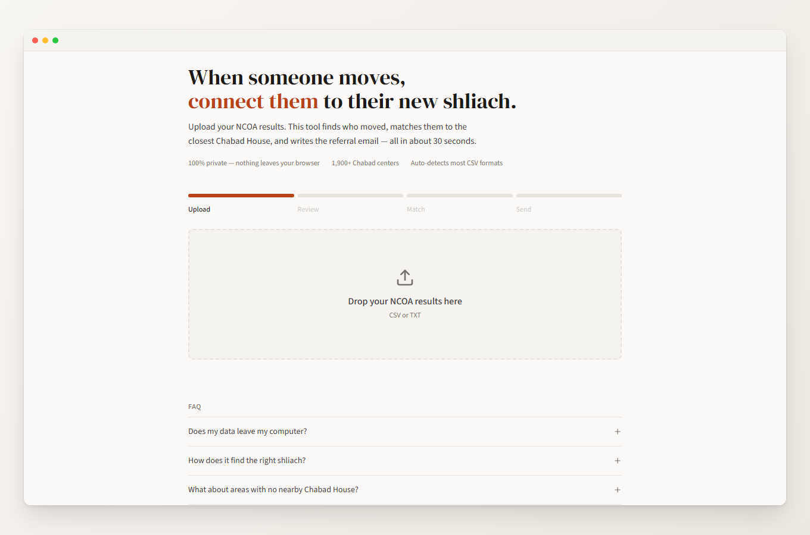
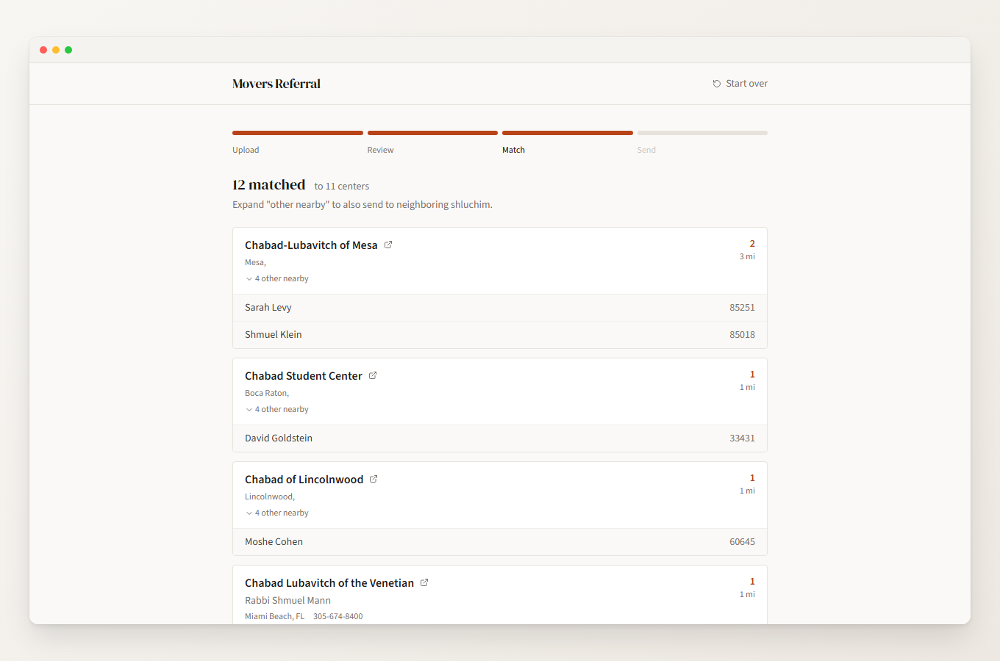
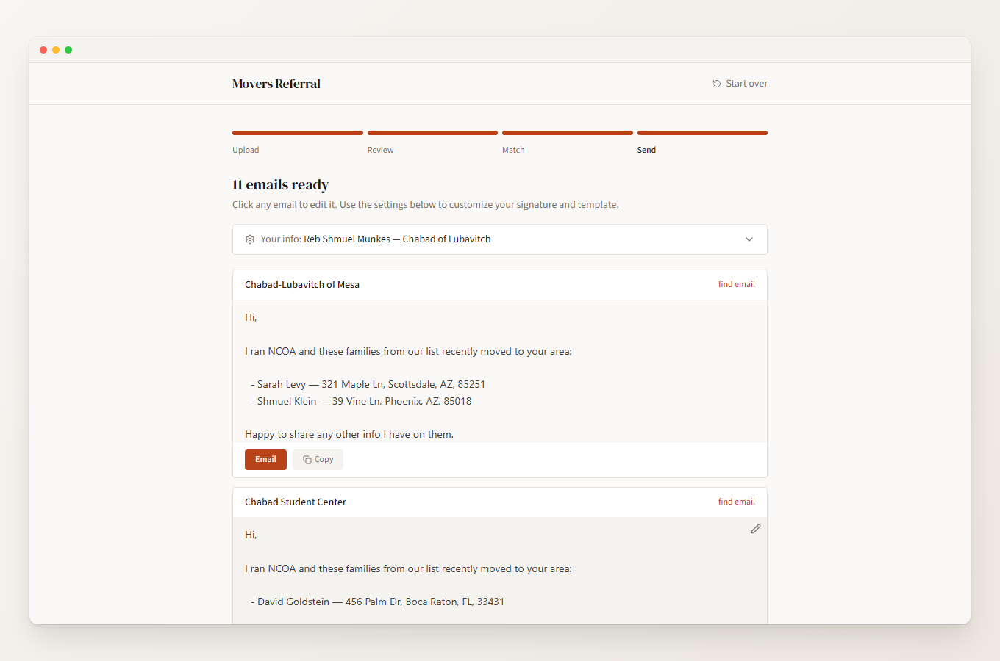

# Movers Referral Tool

When someone moves, connect them to their new shliach.

Upload your NCOA results, match movers to the nearest Chabad House, and generate referral emails. **Everything runs in your browser. No data is ever sent to a server.**



## How It Works

1. **Upload** your NCOA results (CSV from TrueNCOA, NCOASource, Salesforce, ChabadCMS, or any CSV with name/address columns)
2. **Review** detected movers and uncheck anyone you don't want to include
3. **Match** each mover to the closest Chabad House using the chabad.org directory
4. **Send** referral emails to each shliach





## Features

- 100% private - nothing leaves your browser, ever
- Auto-detects CSV format from TrueNCOA, NCOASource, Salesforce, and ChabadCMS
- Manual column mapping if auto-detection doesn't work
- Matches movers to 1,900+ Chabad centers by geographic proximity
- Send to multiple nearby centers for overlapping territories
- Editable email template
- Your info saves locally for next time
- Export matched results as CSV

## Getting Started

```bash
npm install
npm run dev
```

## Tech Stack

React, TypeScript, Vite, Tailwind CSS, PapaParse

## License

MIT
